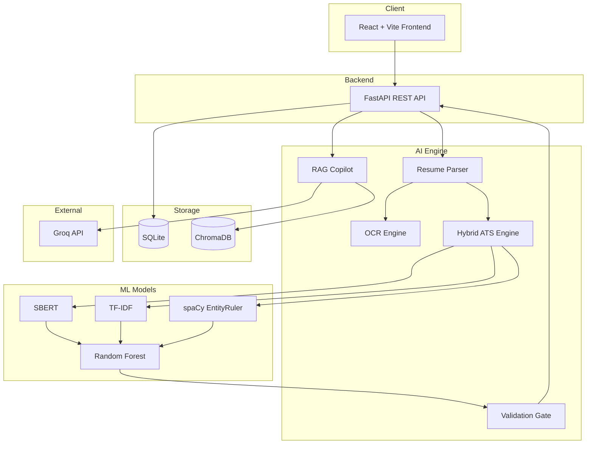
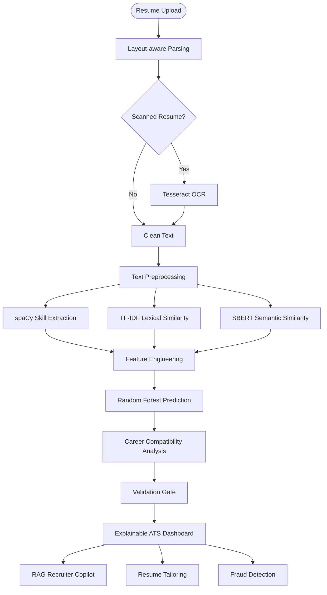
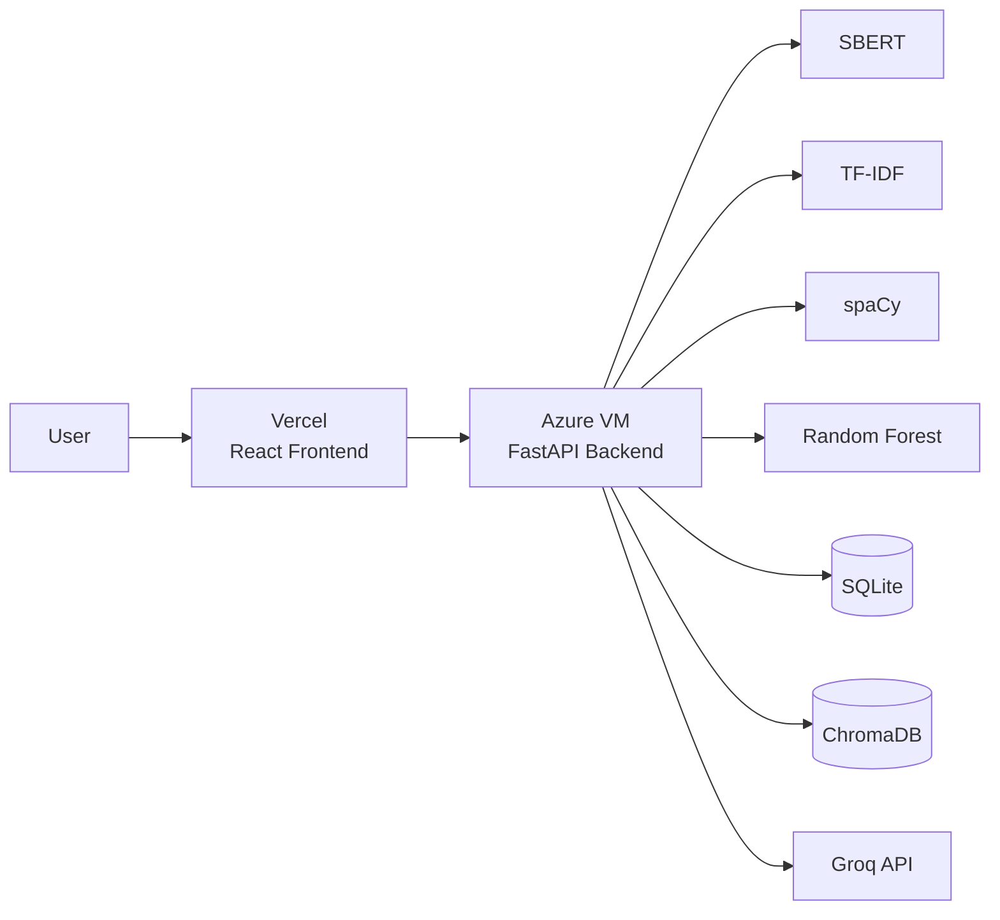

<div align="center">

# 🧠 AI-Based Resume Analyzer

### Explainable AI Recruitment Intelligence Platform

<p align="center">
An AI-powered recruitment intelligence platform that combines semantic NLP, explainable machine learning, deterministic validation, and Retrieval-Augmented Generation (RAG) to deliver transparent ATS scoring, resume optimization, recruiter assistance, and fraud detection.
</p>

<p align="center">


</p>

<p align="center">


</p>

<p align="center">


</p>

<p align="center">

<a href="https://ai-based-resume-analyzer-eta.vercel.app">

</a>

</p>

</div>

---

# 📖 Overview

Traditional Applicant Tracking Systems (ATS) rely heavily on exact keyword matching, often overlooking qualified candidates whose resumes use different terminology despite possessing relevant skills and experience. Recent AI-powered recruitment tools improve semantic understanding but frequently suffer from hallucinations, opaque decision-making, and limited explainability.

The **AI-Based Resume Analyzer** addresses these limitations by combining deterministic Natural Language Processing (NLP), semantic similarity models, machine learning, and Explainable AI into a unified recruitment intelligence platform.

Rather than functioning as a simple resume scanner, the platform performs comprehensive candidate evaluation through multiple independent analysis pipelines, producing transparent hiring insights supported by measurable evidence.

The platform provides:

- 📊 Explainable ATS Scoring
- 🧠 Semantic Resume Analysis
- 🎯 Job Description Matching
- 🔍 Technical Skill Extraction
- 🛡 AI Validation Gate
- 🚨 Resume Fraud Detection
- ✍ AI Resume Tailoring
- 💬 RAG-powered Recruiter Copilot

Every evaluation is designed to remain transparent, reproducible, and explainable instead of relying solely on black-box AI predictions.

---

# ✨ Key Highlights

<table>

<tr>

<td width="50%">

### 🧠 Explainable AI

Every ATS score is accompanied by interpretable metrics including lexical similarity, semantic similarity, technical skill overlap, and recruiter-friendly explanations.

</td>

<td width="50%">

### 🤖 Hybrid AI Pipeline

Combines TF-IDF, Sentence-BERT, spaCy EntityRuler, Random Forest, and Retrieval-Augmented Generation into a single evaluation workflow.

</td>

</tr>

<tr>

<td>

### 🛡 Validation Gate

Automatically validates AI-generated resume improvements to prevent hallucinated skills and unsupported claims before presenting results.

</td>

<td>

### 🚨 Fraud Detection

Detects hidden keyword stuffing, suspicious resume manipulation, and formatting tricks designed to deceive Applicant Tracking Systems.

</td>

</tr>

<tr>

<td>

### 📄 Layout-aware Parsing

Preserves document structure during PDF extraction while supporting OCR for scanned resumes.

</td>

<td>

### 💬 Recruiter Copilot

Provides conversational question-answering over resumes using Retrieval-Augmented Generation without relying solely on generic LLM knowledge.

</td>

</tr>

</table>

---

# 🎯 Why This Project?

Modern recruitment systems typically fall into one of two categories.

### Traditional ATS

Traditional Applicant Tracking Systems rely primarily on exact keyword matching. While efficient, they often fail to recognize candidates who describe equivalent skills using different terminology, leading to missed opportunities and inaccurate rankings.

### Modern AI Recruiters

Many AI-powered recruitment platforms rely heavily on Large Language Models to evaluate resumes. Although these systems understand context better, they may produce hallucinated information, inconsistent evaluations, and opaque decision-making that is difficult for recruiters to verify.

### This Platform

The AI-Based Resume Analyzer combines deterministic NLP techniques with semantic embeddings, machine learning, and explainable AI to create a transparent evaluation framework.

Instead of replacing recruiter judgment, the platform augments decision-making by presenting measurable evidence for every recommendation and maintaining a human-in-the-loop workflow.

---

# 🚀 Core Features

## 📄 Layout-aware Resume Parsing

The platform extracts structured information from PDF resumes while preserving reading order and document layout using PyMuPDF. Image-based resumes are automatically processed through OCR before entering the NLP pipeline.

---

## 🧠 Hybrid ATS Engine

Candidate evaluation combines three complementary approaches:

- TF-IDF Lexical Similarity
- Sentence-BERT Semantic Similarity
- Deterministic Skill Extraction

These independent signals are fused through a machine learning model to produce a balanced ATS score.

---

## 📊 Explainable ATS Scoring

Unlike conventional ATS systems, every recommendation includes transparent supporting metrics including:

- ATS Score
- Semantic Match
- Keyword Match
- Skill Coverage
- Missing Skills
- Experience Analysis
- Education Analysis

Recruiters can understand exactly why a candidate received a particular score.

---

## 🎯 Semantic Matching

The platform leverages **Sentence-BERT (SBERT)** embeddings to capture contextual relationships between resumes and job descriptions beyond simple keyword overlap.

Unlike traditional ATS systems that depend solely on exact terminology, semantic embeddings recognize equivalent technical concepts even when expressed differently, improving candidate matching across diverse writing styles.

---

## 🔑 Skill Extraction

Technical skills are extracted using a deterministic **spaCy EntityRuler** backed by a curated JSON skill dictionary.

Unlike generative AI approaches, this rule-based extraction process provides consistent and reproducible results without introducing hallucinated technologies or unsupported skills.

Extracted skills are categorized and compared against the job description to identify:

- Matching Skills
- Missing Skills
- Additional Skills
- Skill Coverage

---

## 🌲 Random Forest Scoring

The platform employs a **Random Forest Regression** model to generate the final ATS score.

Instead of relying on a single similarity metric, the model combines multiple independent evaluation signals to produce a balanced assessment.

The scoring pipeline incorporates:

- Lexical Similarity
- Semantic Similarity
- Skill Overlap

The resulting prediction is further refined using domain compatibility analysis to reduce false positives between unrelated technical domains.

---

## 🛡 Validation Gate

Generative AI can occasionally introduce unsupported skills or modify resume content beyond the source document.

To mitigate this risk, the platform includes a **Validation Gate**, a deterministic verification layer that audits AI-generated resume enhancements before they are accepted.

The Validation Gate:

- Detects unsupported technical skills
- Rejects hallucinated content
- Preserves factual consistency
- Compares generated content with the original resume
- Ensures recruiter trust in AI-assisted recommendations

---

## 🚨 Fraud Detection

Resume manipulation remains a common technique used to deceive Applicant Tracking Systems.

The platform automatically detects suspicious patterns including:

- Hidden white-text keyword stuffing
- Artificial keyword repetition
- Formatting anomalies
- Suspicious document manipulation

Potentially fraudulent resumes are immediately flagged, allowing recruiters to review them before continuing with evaluation.

---

## 💬 RAG Recruiter Copilot

The platform integrates **Retrieval-Augmented Generation (RAG)** to provide an intelligent recruiter assistant.

Instead of relying solely on pre-trained language model knowledge, responses are grounded in the candidate's resume and extracted information.

Recruiters can ask questions such as:

- What backend technologies has this candidate worked with?
- Does the candidate have cloud deployment experience?
- Summarize the candidate's project experience.
- What technical skills are missing for this job?
- Why was this ATS score assigned?

This enables natural language exploration while maintaining factual consistency.

---

## ✍ AI Resume Tailoring

The Resume Tailoring module generates optimized resume content aligned with a target job description.

Rather than blindly rewriting the resume, every AI-generated suggestion passes through the Validation Gate to ensure:

- No fabricated skills
- No unsupported experience
- No misleading claims
- Improved keyword relevance
- Preserved semantic meaning

This allows candidates to optimize resumes while maintaining authenticity.

---

# 🏗️ System Architecture

The platform follows a modular client-server architecture that separates user interaction, AI processing, machine learning, and data storage into independent layers.



---

## Architecture Overview

The application is divided into independent layers to improve maintainability, scalability, and deployment flexibility.

### Frontend

The frontend is built using **React**, **Vite**, and **Tailwind CSS**, providing an interactive dashboard for recruiters and candidates.

---

### Backend

A **FastAPI** server exposes REST APIs responsible for:

- Resume uploads
- Job description processing
- ATS evaluation
- Resume tailoring
- Recruiter Copilot
- Fraud detection

---

### AI Processing Layer

The AI Engine orchestrates:

- Resume Parsing
- OCR Processing
- Skill Extraction
- Semantic Matching
- Lexical Matching
- Machine Learning Scoring
- Validation Gate
- RAG Question Answering

Each module performs a specialized task before passing results to the next stage.

---

### Data Layer

The application stores:

- User information
- Job descriptions
- Resume metadata
- ATS results
- Historical analyses

Semantic document embeddings are indexed inside **ChromaDB** for efficient retrieval during recruiter conversations.

---

# 🔄 AI Processing Pipeline

Every uploaded resume follows a structured multi-stage evaluation pipeline.



---

## Processing Workflow

The platform evaluates resumes through multiple independent analysis stages instead of relying on a single AI model.

### Step 1 — Resume Parsing

The uploaded PDF is parsed using PyMuPDF.

If the document is image-based, OCR is automatically performed before continuing.

---

### Step 2 — Feature Extraction

The parsed text is processed through three complementary pipelines:

- TF-IDF
- Sentence-BERT
- spaCy EntityRuler

Each pipeline contributes unique information about the candidate profile.

---

### Step 3 — Machine Learning

The extracted features are combined and evaluated using a Random Forest model to generate an initial ATS score.

---

### Step 4 — Domain Compatibility

The predicted score is refined through compatibility analysis to reduce artificially inflated similarity between unrelated technical domains.

---

### Step 5 — Validation

AI-generated content is verified before presentation to ensure factual consistency and eliminate hallucinated information.

---

### Step 6 — Recruiter Experience

The final dashboard presents:

- ATS Score
- Explainable Metrics
- Missing Skills
- Resume Recommendations
- Fraud Alerts
- Recruiter Copilot

# 🛠️ Technology Stack

<table>

<tr>
<th width="25%">Category</th>
<th>Technologies</th>
</tr>

<tr>
<td><strong>Frontend</strong></td>
<td>React.js • Vite • Tailwind CSS • Recharts</td>
</tr>

<tr>
<td><strong>Backend</strong></td>
<td>FastAPI • Python • SQLAlchemy</td>
</tr>

<tr>
<td><strong>Database</strong></td>
<td>SQLite</td>
</tr>

<tr>
<td><strong>Natural Language Processing</strong></td>
<td>spaCy • Sentence-BERT (SBERT) • TF-IDF</td>
</tr>

<tr>
<td><strong>Machine Learning</strong></td>
<td>Scikit-learn • Random Forest Regression</td>
</tr>

<tr>
<td><strong>Generative AI</strong></td>
<td>Groq API (Llama 3.1 8B Instant) • LangChain</td>
</tr>

<tr>
<td><strong>Vector Database</strong></td>
<td>ChromaDB</td>
</tr>

<tr>
<td><strong>Document Processing</strong></td>
<td>PyMuPDF • Tesseract OCR</td>
</tr>

<tr>
<td><strong>Deployment</strong></td>
<td>Vercel • Microsoft Azure Virtual Machine</td>
</tr>

</table>

---

# ☁️ Deployment Architecture

The platform follows a lightweight cloud deployment strategy that separates frontend hosting, backend services, machine learning inference, and language model integration.



## Deployment Components

| Component | Service |
|------------|---------|
| Frontend | Vercel |
| Backend API | Microsoft Azure Virtual Machine |
| Machine Learning | Local Inference |
| NLP Models | Local Inference |
| LLM | Groq API |
| Database | SQLite |
| Vector Database | ChromaDB |

The platform performs semantic analysis, machine learning inference, and deterministic validation locally within the backend while utilizing Groq's hosted language models for conversational AI capabilities.

---

# 📸 Platform Preview


---

## 🏠 Home Page

```
docs/images/home.png
```

> Landing page with project overview and feature highlights.

---

## 📄 Resume Upload


> Resume upload interface supporting PDF documents and Job Description input.

---

## 📊 ATS Analysis Dashboard


> Interactive dashboard displaying ATS score, semantic similarity, lexical similarity, technical skill analysis, and explainable insights.

---

## 🧠 Explainable AI Dashboard


> Visual breakdown of candidate evaluation metrics with transparent scoring explanations.

---

## 🎯 Resume Tailoring

``` 
docs/images/tailoring.png
```

> AI-assisted resume optimization aligned with target job descriptions.

---

## 🛡 Validation Gate


> Deterministic validation workflow preventing unsupported skills and hallucinated content.

---

## 🚨 Fraud Detection

```

```

> Automatic detection of hidden keyword stuffing and suspicious resume manipulation.

---

## 💬 Recruiter Copilot


> Retrieval-Augmented Generation (RAG) assistant providing grounded answers about candidate profiles.

---

# 📁 Repository Structure

```text
AI-Based-Resume-Analyzer
│
├── backend/
│   ├── models/
│   ├── routes/
│   ├── services/
│   ├── utils/
│   ├── database/
│   └── main.py
│
├── frontend/
│   ├── src/
│   ├── public/
│   └── components/
│
├── docs/
│   └── images/
│
├── requirements.txt
├── README.md
└── LICENSE
```

> **Note:** Update the folder structure above to match your actual repository before publishing.

---

# 🔬 Research Highlights

The platform incorporates multiple AI and NLP techniques into a unified recruitment intelligence workflow.

### Hybrid Multi-Vector Analysis

Candidate evaluation combines lexical similarity, semantic similarity, and deterministic skill extraction instead of relying on a single scoring strategy.

---

### Explainable Machine Learning

Rather than presenting opaque AI predictions, the platform exposes supporting metrics, enabling recruiters to understand how each recommendation is generated.

---

### Validation Gate

AI-generated resume modifications are verified before being presented, reducing hallucinations and maintaining factual consistency.

---

### Domain Compatibility Analysis

Semantic similarity is refined through domain-aware compatibility analysis, reducing false positives between unrelated technical fields.

---

### Human-in-the-Loop Decision Support

The platform is designed to assist recruiters rather than replace them, providing transparent recommendations that support informed hiring decisions.

---

# 🛣️ Roadmap

Future improvements planned for the platform include:

- [ ] Multi-language resume analysis
- [ ] Additional ATS scoring models
- [ ] Resume benchmarking against industry datasets
- [ ] Interactive recruiter analytics dashboard
- [ ] Support for DOCX and image resume uploads
- [ ] Real-time collaborative recruiter review
- [ ] Candidate profile history and comparison
- [ ] Explainable feature importance using SHAP
- [ ] Cloud-native deployment with Docker and Kubernetes
- [ ] Multi-tenant enterprise architecture

---

# 🤝 Contributing

Suggestions, feature requests, and improvements are welcome.

If you discover a bug or have ideas to improve the platform, feel free to open an issue or submit a pull request.

---

# 👨‍💻 Author

## Ankith Uday Binagekar

Full Stack Developer

Building AI-powered software focused on Natural Language Processing, Machine Learning, Explainable AI, and intelligent developer tools.

**GitHub**

https://github.com/AnkithBinagekar

**LinkedIn**

> [Ankith Binagekar](https://www.linkedin.com/in/ankithbinagekar/)

**Email**

> ankithbinagekar2002@gmail.com
---

# ⭐ Support

If you found this project useful, consider giving it a ⭐ on GitHub.

It helps others discover the project and supports continued development.

---

# 📜 License

This project is licensed under the **MIT License**.

See the **LICENSE** file for more information.
